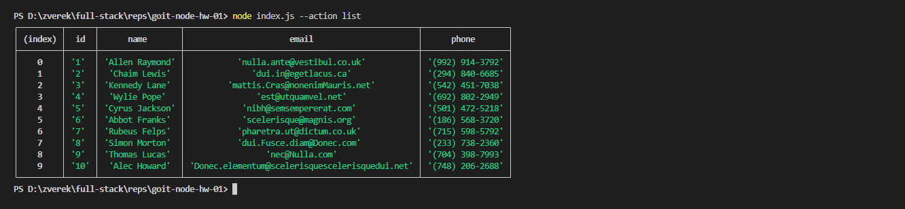

# Get and display the entire list of contacts in the form of a table (console.table)

<code>node index.js --action list
</code>
 
<a href="https://prnt.sc/MT_CClQ3_OKc">link</a>
 

# Get contact by id

<code>node index.js --action get --id 5
</code>
 
<a href="https://prnt.sc/LI4HO0IB-X-s">link</a>
 

# Add the contact

<code>node index.js --action add --name Mango --email mango@gmail.com --phone 322-22-22
</code>
 
<a href="https://prnt.sc/8yo8P3L0_RoY">link</a>
 

# Delete the contact

<code>node index.js --action remove --id=3
</code>
 
<a href="https://prnt.sc/ViFojxn97m6k">link</a>
 

